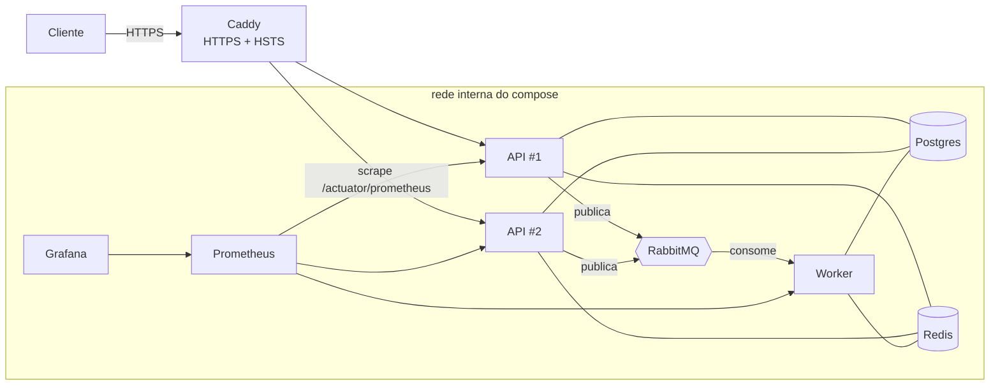

# Mercury Shop

E-commerce / Order Management API — backend RESTful seguro e escalável.
A especificação completa (fonte de verdade) fica no documento interno de instruções e
roadmap do projeto, mantido fora do versionamento (ver `.gitignore`).

> **Status:** todas as 5 fases do roadmap concluídas. Backend de e-commerce com catálogo, usuários/
> segurança (JWT RSA, RBAC), pedidos transacionais (lock otimista + idempotência), assíncrono via
> RabbitMQ (pagamento → `OrderPaid` → fatura/e-mail com DLQ) e cache; pronto para produção com
> **observabilidade** (Prometheus + Grafana), **Caddy (HTTPS+HSTS)**, **worker separado** e **CI**.
> Arquitetura hexagonal · Postgres + Flyway + Redis + RabbitMQ · **47 testes verdes**.

---

## Stack

Java 21 · Spring Boot 3.4 · Maven · Spring Web/Validation/Data JPA · PostgreSQL · Flyway ·
**Spring Security + OAuth2 Resource Server (JWT RSA)** · **Redis** (refresh tokens, lockout, rate limiting, cache) ·
**Bucket4j** (rate limiting) · **RabbitMQ / Spring AMQP** (eventos assíncronos, DLQ) · **Stripe** (pagamento, com gateway stub em dev/test) ·
**Micrometer + Prometheus + Grafana** · **Caddy** (HTTPS) · springdoc-openapi (dev) · Actuator ·
JUnit 5 + Testcontainers · GitHub Actions (CI).

## Arquitetura — Hexagonal (Ports & Adapters)

O domínio não conhece HTTP nem JPA. Cada feature segue `domain → application → adapter`:

```
product/   catálogo (Fase 1) — leitura cacheada no Redis (Fase 4)
cart/      carrinho por usuário no Redis (Fase 3)
order/     checkout transacional, lock otimista, idempotência, cancelamento (Fase 3)
payment/   pagamento (PENDING→PAID) + evento OrderPaid (Fase 4)
invoice/   geração de fatura por worker ao receber OrderPaid (Fase 4)
user/      cadastro, autenticação, RBAC (Fase 2)
  domain/         User, Role, UserStatus, OneTimeToken, PasswordPolicy + portas
                  (UserRepository, RefreshTokenStore, LoginAttemptStore, PasswordHasher,
                   TokenGenerator, AccessTokenIssuer, EmailSender, ...)
  application/    AuthService, UserService (casos de uso) + commands
  adapter/
    in/web/       AuthController, UserController, AdminUserController + DTOs (records)
    out/persistence/  JPA (users, user_roles, one_time_tokens)
    out/security/     BCrypt, emissor de JWT RSA, gerador de tokens
    out/redis/        refresh tokens (rotação/revogação) e bloqueio de login
    out/email/        publica e-mails na fila (RabbitMQ)
    in/messaging/     EmailWorker (consome a fila e entrega; falha → DLQ)
shared/
  security/       SecurityConfig (deny-by-default, RBAC, headers, CORS), JWT (RSA),
                  RateLimitingFilter (Bucket4j+Redis), AuditLogger
  messaging/      RabbitConfig (exchange/DLX/filas/DLQ), DomainEventPublisher, eventos (OrderPaid)
  idempotency/    IdempotencyStore (Redis) para o checkout
  exception/      GlobalExceptionHandler + ApiError (formato de erro padrão)
  web/            RequestIdFilter (request_id por requisição)
  config/         CacheConfig (@EnableCaching), AsyncConfig
  application/    PageQuery / PageResult (paginação independente de framework)
```

### Decisões de assíncrono/cache (Fase 4)
- **Pagamento stub** marca o pedido `PAID` e publica **`OrderPaid`** **após o commit** (não emite em rollback).
- **Workers** consomem `OrderPaid`: geram **fatura** (idempotente por pedido) e publicam o **e-mail de confirmação**.
- **E-mails por fila**: verificação/reset/confirmação são publicados; um worker entrega (stub/log) com **retry → DLQ**.
- **Estoque**: a baixa ocorre no checkout (Fase 3); os workers de `OrderPaid` **não** redecrementam (trade-off documentado).
- **Cache do catálogo** (Redis, TTL 10 min): `GET /v1/products/{id}` é cacheado; edição/remoção fazem evict.
  Mudanças de estoque no checkout refletem no detalhe do produto por TTL (consistência eventual).

### Decisões de segurança (Fase 2)
- **Access token = JWT RSA (RS256)**, vida 15 min, payload só `sub`+`roles`+`exp`. Chaves de env;
  em dev/test sem chave configurada, gera-se um par **efêmero** no boot (nunca usar em prod).
- **Refresh token = string opaca** em cookie `HttpOnly; Secure; SameSite=Strict`, guardado como
  hash no Redis (whitelist) com **rotação** (o antigo é invalidado) e revogação no logout/reset.
- **Senhas com BCrypt (custo 12)**; política forte (≥ 12 chars com maiúscula, minúscula, dígito e símbolo).
- **Tokens de verificação (24h) / reset (1h)**: aleatórios, uso único, guardados como **hash**.
- **Bloqueio temporário** após N falhas de login (Redis) e **rate limiting** (Bucket4j+Redis) em
  `/v1/auth/login|register|forgot-password` → `429` + `Retry-After`.
- **Deny by default**; escrita de catálogo e `/v1/users` (admin) exigem `ADMIN`; leitura de catálogo é pública.
- Headers de segurança (CSP, X-Frame-Options DENY, nosniff, Referrer-Policy, HSTS), **CORS** com allowlist.
- **DTOs sempre** (entidades JPA nunca serializadas); `passwordHash`/`version` nunca saem nas respostas.
- Auditoria estruturada de eventos de segurança com `request_id` e e-mail mascarado.

### Decisões da Fase 7 (pagamento real)
- **Pagamento assíncrono via gateway**: `/pay` cria um **PaymentIntent** (Stripe) e devolve o `clientSecret`;
  o pedido só vira `PAID` quando o **webhook** de sucesso chega. Espelha o fluxo real de gateways.
- **Porta `PaymentGateway`** com dois adapters: **`StripePaymentGateway`** (`mercury.payment.provider=stripe`,
  SDK oficial, assinatura do webhook verificada via `Webhook.constructEvent`, `orderId` em metadata) e
  **`StubPaymentGateway`** (default — roda em dev/test **sem credenciais**, igual ao JWT efêmero e ao e-mail stub).
- **Webhook idempotente e seguro**: endpoint público protegido pela verificação de assinatura; reprocessar o
  mesmo evento é no-op (o pedido só transita a partir de `PENDING`). A confirmação grava `OrderPaid` no **outbox** (Fase 6).
- **Segredos** (`secret-key`, `webhook-secret`) apenas via variáveis de ambiente.

### Decisões da Fase 6 (evolução do núcleo)
- **Transactional Outbox**: o evento `OrderPaid` é gravado na tabela `outbox_event` **na mesma transação**
  do pagamento; um relay (`OutboxRelay`, `@Scheduled`) publica no RabbitMQ depois, processando um evento
  por transação com `FOR UPDATE SKIP LOCKED` (seguro com réplicas) — garante *at-least-once* mesmo se o
  broker estiver fora no commit. Substitui a publicação `afterCommit`.
- **Ciclo do pedido completo**: `PENDING → PAID → SHIPPED → DELIVERED` (+ `CANCELLED`). Ship/deliver via
  `/v1/admin/orders/{id}/ship|deliver`, restritos a **ADMIN/STAFF**; transições inválidas → `409`.
- **Reserva de estoque por expiração** (Modelo A): o estoque é debitado no checkout (o pedido `PENDING`
  *segura* o estoque) e um sweeper agendado cancela pedidos não pagos após `mercury.orders.payment-window`
  (default 30 min), devolvendo o estoque. O banco continua a única fonte de verdade do estoque.
- **ArchUnit**: testes que travam as fronteiras hexagonais (domínio sem Spring/JPA; domínio e aplicação
  sem dependência de adapters) — quebram o build se alguém cruzar a fronteira.

## Endpoints

### Autenticação (`/v1/auth`, público + rate limited)
| Método | Rota | Descrição |
|---|---|---|
| POST | `/register` | cadastro (cria `PENDING_VERIFICATION`, dispara e-mail de verificação) |
| GET | `/verify?token=` | ativa a conta |
| POST | `/login` | retorna access token (JWT) + cookie `refresh_token` |
| POST | `/refresh` | novo access token, rotaciona o refresh (lê o cookie) |
| POST | `/logout` | revoga o refresh token |
| POST | `/forgot-password` | envia token de reset (resposta sempre genérica) |
| POST | `/reset-password` | redefine a senha |

### Usuário (`/v1/users`)
| Método | Rota | Acesso |
|---|---|---|
| GET | `/me` | autenticado |
| PATCH | `/me` | autenticado |
| POST | `/me/change-password` | autenticado (exige senha atual) |
| GET | `/` · `/{id}` | **ADMIN** |

### Catálogo (`/v1`)
Leitura (`GET /v1/products`, `/v1/categories`) **pública**; escrita (`POST/PATCH/DELETE`) exige **ADMIN**.

### Carrinho (`/v1/cart`, autenticado)
| Método | Rota | Descrição |
|---|---|---|
| GET | `/v1/cart` | carrinho atual com preços e total |
| POST | `/v1/cart/items` | adiciona/incrementa item `{productId, quantity}` |
| PUT | `/v1/cart/items/{productId}` | define quantidade (`0` remove) |
| DELETE | `/v1/cart/items/{productId}` · `/v1/cart` | remove item · limpa |

### Pedidos (`/v1/orders`, autenticado)
| Método | Rota | Descrição |
|---|---|---|
| POST | `/v1/orders` | checkout do carrinho — header **`Idempotency-Key` obrigatório**; baixa estoque (lock otimista) → `PENDING` |
| GET | `/v1/orders` · `/v1/orders/{id}` | próprios pedidos (outro usuário → 404) |
| POST | `/v1/orders/{id}/pay` | **inicia** o pagamento (cria a cobrança no gateway; devolve `clientSecret`). Pedido segue `PENDING` |
| POST | `/v1/payments/webhook` | webhook do gateway (público, **assinatura verificada**): confirma `PENDING`→`PAID` e dispara `OrderPaid` |
| POST | `/v1/orders/{id}/cancel` | cancela `PENDING` e restaura estoque |
| GET | `/v1/admin/orders` | todos os pedidos (**ADMIN**) |
| POST | `/v1/admin/orders/{id}/ship` | `PAID`→`SHIPPED` (**ADMIN/STAFF**) |
| POST | `/v1/admin/orders/{id}/deliver` | `SHIPPED`→`DELIVERED` (**ADMIN/STAFF**) |

Formato de erro padrão:

```json
{ "error": { "code": "UNAUTHORIZED", "message": "E-mail ou senha inválidos", "requestId": "req_ab12cd34ef56" } }
```

## Como rodar (dev)

Pré-requisitos: **Java 21**, **Docker**. Maven **não** é necessário — use o wrapper (`mvnw`/`mvnw.cmd`).

```bash
# 1. Variáveis de ambiente
cp .env.example .env            # ajuste as credenciais

# 2. Sobe Postgres + Redis + RabbitMQ
docker compose up -d

# 3. Roda a aplicação no perfil dev (sem JWT_*_KEY no .env, gera par RSA efêmero)
./mvnw spring-boot:run -Dspring-boot.run.profiles=dev      # Linux/macOS
# Windows (PowerShell):
# .\mvnw.cmd spring-boot:run "-Dspring-boot.run.profiles=dev"
```

- API: `http://localhost:8080` · Swagger (dev): `/swagger-ui.html` · Health: `/actuator/health`
- RabbitMQ (dev): painel em `http://localhost:15672` (filas `q.email`, `q.order-paid.*` e suas `*.dlq`)
- Para chaves RSA fixas em prod, gere e injete via env (`JWT_PRIVATE_KEY`/`JWT_PUBLIC_KEY`):
  ```bash
  openssl genpkey -algorithm RSA -pkeyopt rsa_keygen_bits:2048 -out jwt-private.pem
  openssl rsa -in jwt-private.pem -pubout -out jwt-public.pem
  ```
- Cookie do refresh é `Secure`: em navegador, use HTTPS; via curl/MockMvc funciona em HTTP.

## Testes

```bash
./mvnw test          # ou .\mvnw.cmd test no Windows
```

- **Unitários:** invariantes de domínio (`Product`, `User`, `PasswordPolicy`, `Order`, `Cart`) — sem Spring.
- **Integração (Testcontainers, Postgres + Redis + RabbitMQ):** catálogo com RBAC; fluxo de auth
  (register → verify → login → `/me`, rotação de refresh, rate limit `429`, 401/403); carrinho →
  checkout → idempotência → cancelamento; pagamento → fatura async; e-mail por fila + **DLQ**; cache. Requer Docker.
- **Concorrência:** M compradores no último item; o estoque **nunca fica negativo** (lock otimista).
- **Observabilidade:** a métrica custom `mercury.orders.placed` é instrumentada (Micrometer/Prometheus).

## Produção (deploy)

Topologia (Fase 5):



- **API stateless replicada** (consumidores desligados) atrás do **Caddy** (HTTPS automático, HSTS, balanceamento).
- **Worker separado** (`MERCURY_MESSAGING_CONSUMERS_ENABLED=true`) consome as filas; a API só publica.
- Postgres/Redis/RabbitMQ/Prometheus **só na rede interna**; o Caddy não roteia `/actuator/*`.
- **Logs estruturados (JSON/ECS)** com `requestId`; métricas no Prometheus; dashboard provisionado no Grafana.

```bash
cd deploy
cp .env.example .env          # defina senhas e as chaves RSA (JWT_PRIVATE_KEY/JWT_PUBLIC_KEY)
docker compose up -d --build  # caddy + api×2 + worker + postgres + redis + rabbitmq + prometheus + grafana
```
- App via Caddy: `https://localhost` (TLS interno) ou o domínio configurado · Grafana: `http://localhost:3000`.

## Build / Docker

```bash
./mvnw clean package
docker build -t mercury-shop:latest .   # multi-stage (runtime JRE 21, usuário não-root)
```

CI: **GitHub Actions** (`.github/workflows/ci.yml`) roda `mvnw verify` (Testcontainers) e valida o build da imagem em cada push/PR.

## Roadmap

Fase 1 ✅ Fundação · Fase 2 ✅ Usuários + Segurança · Fase 3 ✅ Pedidos (checkout/lock otimista/idempotência) ·
Fase 4 ✅ Assíncrono (RabbitMQ) + cache · Fase 5 ✅ Produção (observabilidade, Caddy/HTTPS, compose completo, CI) ·
Fase 6 ✅ Núcleo (Transactional Outbox, ciclo SHIPPED/DELIVERED, reserva de estoque por expiração, ArchUnit) ·
**Fase 7 ✅ Pagamento real** (Stripe — PaymentIntent + webhook idempotente assinado).

Evolução planejada (ver plano interno): Fase 8 — segurança avançada (MFA/TOTP, detecção de reuso de refresh,
LGPD) · Fase 9 — ops & CD (OpenTelemetry, Alertmanager, deploy).
